# BitFun Agent SDK 产品与宿主架构设计

本文定义 BitFun Agent SDK 的公开产品心智、与 GUI/TUI/Headless CLI/ACP/Server 的关系、内部 SDK Host
边界，以及对外发布前必须满足的能力和兼容性门槛。智能体内核和 Rust crate 归属继续由
[`agent-runtime-services-design.md`](agent-runtime-services-design.md) 定义；产品级接口切面由
[`product-architecture.md`](product-architecture.md) 定义；CLI/TUI 体验由
[`cli-product-line-design.md`](cli-product-line-design.md) 定义；扩展能力导入和宿主适配由
[`capability-runtime-integration-design.md`](extensions/capability-runtime-integration-design.md) 定义。

本文只记录长期产品心智、架构边界和发布门槛。当前代码中的
`agent-runtime::sdk` 是供 BitFun 内部入口和受控 Rust 嵌入使用的低层 Rust Runtime SDK；
`interfaces/sdk-host` 与 `apps/sdk-host` 是本地协议和独立 Host 进程的实现候选。它们都不是已经发布的
Python/TypeScript BitFun Agent SDK，也不能据此宣称公开 SDK 已交付。

## 1. 最终决策

BitFun 不选择“复制 Claude”“复制 OpenCode”或“复制 Codex”中的任一条单一路线，而是按不同问题采用各自已经验证的做法：

| 问题 | 采用的成熟做法 | BitFun 决策 |
|---|---|---|
| 用户如何运行 Agent | Claude Agent SDK 的 Agent、Session、消息流、Tool、MCP、Permission、Hook 心智 | 公开 API 使用行业常见 Agent 概念，不暴露内部端口、协议和 Product Assembly |
| 如何让多个产品入口共享能力 | OpenCode 的 Server/Core 多客户端模式，Codex App Server 的 rich-client 边界 | 所有入口调用同一 Agent Runtime API；入口是同级 adapter，不相互依赖 |
| SDK 如何保持简洁 | Codex SDK 的精选 Thread/Turn 用例，而不是全量管理 API | 公开 SDK 只提供 Agent 应用所需的高层用例，不直接镜像内部或 Server 全部路由 |
| 本地 Runtime 如何交付 | Claude/Copilot SDK 管理匹配原生 runtime，Codex App Server 的握手与 schema 纪律 | SDK 默认管理匹配的本地 `bitfun-sdk-host`；用户不需要安装 CLI |
| 多语言如何一致 | Copilot SDK 的单协议、多语言包、协议版本范围和 codegen drift check | Python/TypeScript 是同一 SDK 的语言绑定，共用一个 Host 协议和一致性套件 |
| 外部开发者如何定制界面 | Vercel AI SDK UI 的状态/transport 分离与 AI Elements 的 copy-source 组件 | Preview 提供最小参考应用；有真实复用后再抽取可选组件层，不形成第二套“UI SDK” |

一句话定义：

> BitFun Agent SDK 是同一 BitFun Agent Runtime 面向应用开发者的公开语言门面；它不是新的 Runtime，
> 不是 CLI/Server 的别名，也不是 GUI/TUI 的底层依赖。

最终只向普通用户和外部开发者呈现三种产品选择：

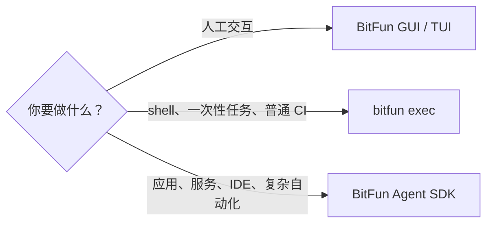

ACP、Server、SDK Host、跨进程协议（wire protocol）和 Rust Runtime SDK 是互操作或内部工程边界，
不应成为首次使用时的产品选项。

## 2. 竞品复核与客观取舍

本节按 2026-07-24 的官方文档和公开代码核对。OpenCode 代码基线为
[`2ea4bb793e`](https://github.com/anomalyco/opencode/tree/2ea4bb793ec9240251b39706fb5564039023fd79)，
Codex 代码基线为
[`f61b51ddd9`](https://github.com/openai/codex/tree/f61b51ddd924643514b33234816a8a2772b1aec7)。
滚动版本的新能力不自动进入 BitFun 稳定承诺；发布前必须冻结对比版本和 fixture。

### 2.1 产品与生态对比

| 维度 | Claude Agent SDK | OpenCode SDK / Server | Codex SDK / App Server | Copilot SDK | 对 BitFun 的启发 |
|---|---|---|---|---|---|
| 公开心智 | `query()`、Session、消息流、Tool/MCP/Hook/Permission | type-safe Server client、资源和路由 | 精选 Thread/Turn SDK；rich client 使用 App Server | Session、Message、Tool，多个语言绑定 | Agent SDK 应是高层应用 API，不是内部资源目录 |
| Runtime 交付 | Python/TS 包携带原生 Claude Code binary | SDK 可启动 PATH 中的 Server，也可连接已有 Server | TS SDK 包装 CLI JSONL；App Server 提供更完整协议 | SDK 通过 JSON-RPC 管理 CLI server；部分语言包携带 CLI | 安装 SDK 后应得到匹配 Host，但 CLI 与 SDK Host 不能混为一个产品 |
| 能力深度 | 内置 Tool、MCP、Hook、权限、Subagent、Skill、Plugin、Session、用量 | Project/Session/File/TUI/MCP/Provider 等广泛 Server API | SDK 精简；App Server 有审批、动态工具、事件、配置和稳定/实验分层 | Session、工具、Hook、权限、事件等经协议开放 | GA 能力下限参考 Claude，协议纪律参考 Codex/Copilot |
| 生态发展 | 官方 Python/TS SDK 和完整能力文档；生态围绕 Claude Code 配置与插件 | 开源 Core/Server、Provider/Plugin 生态及 TUI/Web/Desktop/IDE 多客户端 | 开源 Runtime/App Server 快速演进；TS SDK 走 CLI JSONL，Python SDK 绑定匹配 Runtime/App Server | 六种语言包、统一协议和各语言 registry | 首版聚焦 Python/TS，但合同从第一天按可增加语言设计；不把某一语言实现当规范 |
| 多客户端/UI | SDK 示例为主，官方不提供通用 UI SDK | TUI/Web/Desktop/IDE 共享 Server；SDK 可控制 TUI | App、CLI、SDK 分层；App Server 面向 rich client | 面向各语言应用，无统一组件层 | BitFun 第一方界面直接用 Runtime API，外部 UI 经开发者后端使用 SDK |
| 多语言 | Python/TypeScript，部分能力存在语言时差 | 官方主要 JS/TS，OpenAPI 可生成其他客户端 | TS 与 Python 当前底层形态不同 | TS/Python/Go/.NET/Java/Rust，共用协议版本 | 不能让 Python/TS 各写一套 transport 和行为 |
| 可定制程度 | callback、Tool、Hook、MCP、Agent/Skill/Plugin 配置 | Server 全资源控制和插件生态，最开放 | 精选 SDK 较克制，App Server 更底层 | 多语言自定义 Tool/Hook | 公开 API 保持精选；高级资源管理通过明确 capability 增量开放 |
| 发布渠道 | npm、PyPI，包内携带 binary | npm SDK；Server 由 OpenCode 安装提供 | npm SDK、PyPI SDK/Runtime、Codex CLI | npm、PyPI、NuGet、Go module、Maven、crates.io | 语言包走原生 registry；Host 版本必须与 SDK 可验证匹配 |

### 2.2 各产品最值得采用和不应照搬的部分

| 产品 | 采用 | 不照搬 |
|---|---|---|
| Claude | 行业已形成的 Agent SDK 能力心智、第一次调用体验、语言内 callback | 包名、类名、字段名、Hook ABI 和 Claude 专属配置；不承诺 import-compatible |
| OpenCode | 一个 Core/Server 服务多个客户端、managed/client-only 两种连接方式、OpenAPI/codegen 思路 | 全量 Server route 直接成为公开 SDK；不让浏览器或第三方拿到无界本机管理接口 |
| Codex | 精选 SDK、Thread/Turn/Event 分层、初始化/能力协商、稳定/实验 schema | TypeScript 与 Python 使用不同底层 transport；不让公开 SDK退化成 CLI JSONL parser |
| Copilot | 单一 JSON-RPC 合同、多语言 conformance、协议版本范围、CLI/SDK feature matrix | 不让 CLI app 成为 BitFun CLI 的隐藏 SDK server；不接受不同语言安装体验长期分裂 |
| Vercel AI SDK/AI Elements | UI state/transport 分离、组件可组合、copy-source 定制 | 不把 React 组件、框架 Hook 或浏览器 transport 塞进 Agent SDK 核心包 |

### 2.3 BitFun 的能力基线

“至少与 Claude Agent SDK 等价”是 GA 的能力下限之一，但不是架构只能以 Claude 为中心。BitFun 使用三组相互独立的门槛：

1. **Agent 能力门槛**：冻结一个 Claude Agent SDK 稳定版本，核心稳定能力不得静默缺失。
2. **协议与多客户端门槛**：采用 Codex/Copilot 式初始化、能力协商、schema、稳定/实验和跨语言一致性检查。
3. **定制化门槛**：参考 OpenCode 和 Vercel，允许应用与界面定制，但不把内部 Server API 或第一方 UI 固化成 SDK ABI。

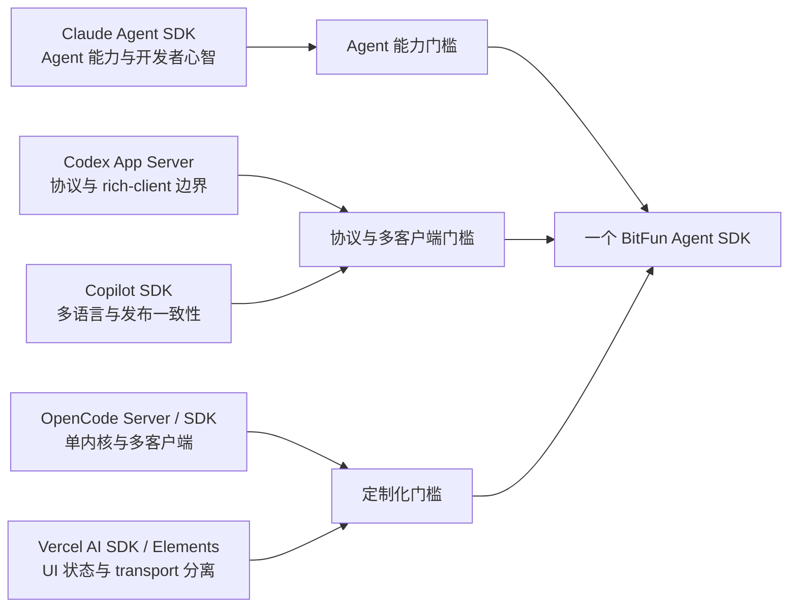

这张图表达的是决策证据来源，而不是把多个竞品 API 拼成一个超集。能力、协议和界面定制分别取证，
最终仍收敛为一套 BitFun 语义和一个公开 SDK。

对标状态只使用以下三个词：

| 状态 | 含义 |
|---|---|
| 原生（native） | BitFun 现有 owner 直接提供同类公开语义 |
| 映射（translated） | 达到同一用户目标，但生命周期或命名按 BitFun 语义表达；差异可查询 |
| 增强（additive） | BitFun 特有能力；不能用来替代行业基础能力 |

## 3. 公开名词与产品边界

### 3.1 用户需要理解的名词

| 名词 | 含义 | 不等于 |
|---|---|---|
| Agent | 模型、指令、工具、权限上限和可选 Subagent 的组合 | 具体 Provider、页面或进程 |
| Session | 可连续工作并按能力持久化、恢复或分支的上下文 | SDK 连接或单次命令 |
| Turn | Session 中一次执行的只读身份与事实；一个 Turn 可包含多个 Model Round | SDK 中另一个可操作运行句柄 |
| Query | 一次 Turn 的唯一实时控制句柄，承载消息流、取消、交互和终态 | 第二种 Session、另一套 Agent Loop 或只读 Turn 事实 |
| Message / Event | 输入、输出、增量、工具/权限请求和生命周期通知 | 内部事件总线 payload |
| Result | Turn 的终态、输出、结构化结果、用量和错误摘要 | stdout 文本本身 |
| Tool | 内置工具、SDK 函数 Tool 或 MCP Tool | 绕过权限和审计的任意函数 |
| Permission | 副作用前的 allow/deny/ask 决策 | SDK 调用方扩大 Host 策略上限的开关 |
| Hook | 在明确生命周期点执行的检查、变换或观察 callback | 通用事件总线或工作流编排 DSL |
| MCP Server | 通过 MCP 提供工具/资源的外部服务 | 第二个 Tool Runtime |
| Subagent | 由当前 Agent 委派且受父级权限、预算和取消约束的执行 | 独立产品 Runtime |
| Skill / Plugin | 可复用说明、资源和经策略启用的扩展包 | 自动受信任的任意代码 |

公开文档不要求用户理解 `SDK Host`、SDK Host protocol、`RuntimeServices`、`DeliveryProfile`、
Rust port/provider、Product Assembly、Tauri adapter 或 Capability Resolution Generation。这些词只出现在贡献者文档和高级诊断中。

### 3.2 只有一个公开 SDK

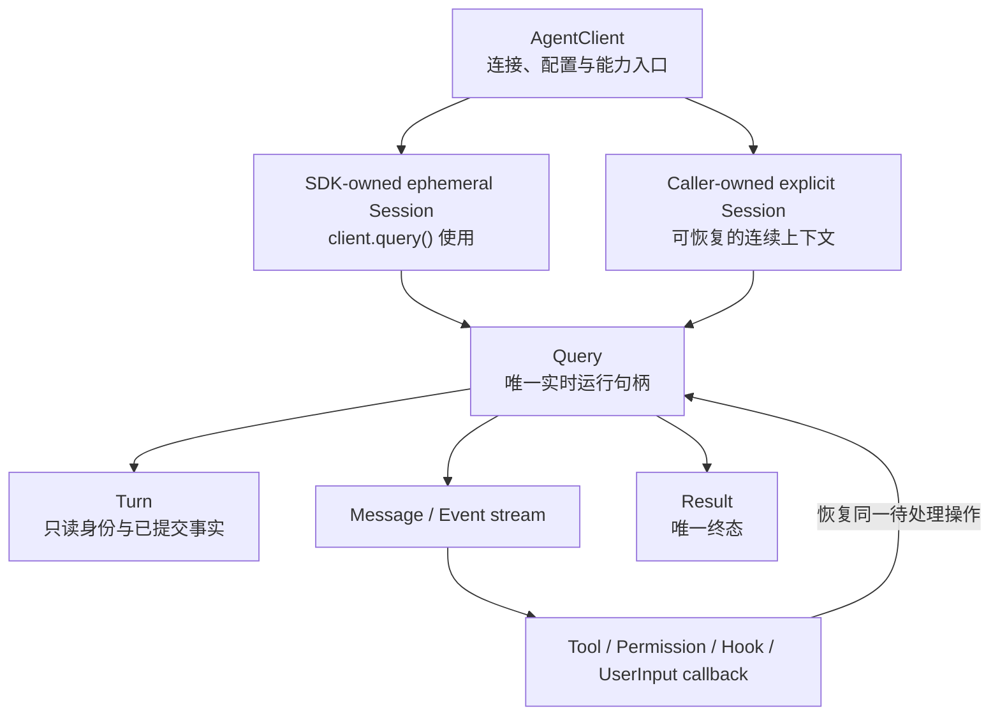

`client.query()` 是常用入口，使用由 SDK 管理的临时 Session；需要恢复、多轮或并发控制时，调用方显式创建
`Session`。`client.query()` 与 `session.startTurn()` 都返回同一种 `Query`，而 `Turn` 只作为 Query 和事件中可读取的
身份与已提交事实。两条路径进入同一个 Runtime 生命周期，不形成第二套 Session 或 Agent loop。

| 层次 | 使用者 | 状态与职责 |
|---|---|---|
| Agent Runtime API | BitFun 各产品 adapter | 唯一 Agent loop 与应用用例边界；不是语言包 |
| Rust Runtime SDK | BitFun 内部入口、受控 Rust 嵌入 | 当前 preview；不等于公开产品 |
| BitFun Agent SDK | Python/TypeScript 应用开发者 | 一个公开产品、多个语言绑定；尚未交付 |

Python SDK、TypeScript SDK、managed Host 和连接预启动 Host 不是四种 SDK。前两者是同一 API 的语言绑定，后两者是 SDK 内部 transport 模式。

## 4. 产品视图：一个 Runtime，多种入口

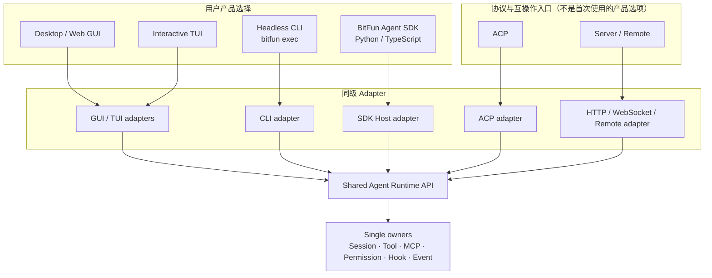

该图冻结四条架构结论：

- GUI/TUI/CLI 同样使用 Query、MCP、Permission 和 Hook，但它们直接经过各自 adapter 调用共享 Runtime API，
  不依赖 Python/TypeScript SDK，也不依赖 SDK Host。
- SDK Host 是跨进程/跨语言 adapter，不拥有 Session、Tool、MCP、Permission、Hook 或 Event 状态。
- 各入口共享业务事实和 owner，不共享 renderer、命令行参数、wire protocol 或平台生命周期。
- 增加 SDK 不得让 CLI、GUI/TUI 或 Server 的底层依赖变深；它只增加一个同级入口。

### 4.1 各形态能做什么

| 形态 | 最适合 | 共享能力 | 形态特有职责 |
|---|---|---|---|
| GUI | 日常交互、审批、设置、诊断和可视化 | Session、Tool/MCP、Permission、Hook 结果、用量与事件 | React/Tauri/Web 渲染、窗口和平台生命周期 |
| TUI | 终端内持续交互 | 与 GUI 相同的业务事实和控制动作 | 终端渲染、键位和终端恢复 |
| Headless CLI | shell、一次性任务、普通 CI、简单脚本 | Query、结构化输出、取消、非交互权限策略 | flags、stdin/stdout/stderr、退出码、JSON/JSONL |
| Agent SDK | 应用、服务、IDE、复杂自动化和语言内扩展 | CLI 的 Agent 能力，加 typed objects、并发 Session 和 callback | Python/TypeScript API、Host 生命周期、函数 Tool/Permission/Hook callback |
| ACP | 编辑器与 Agent 的标准互操作 | ACP 稳定规范能表达的 Session/Tool/Permission/Event 子集 | ACP 协议、兼容映射和降级 |
| Server/Remote | 远程控制、多设备和服务化接入 | Host capability 与远程策略允许的共享用例 | 认证、网络、执行域、断线恢复和远程策略 |

## 5. 运行视图：SDK 如何进入同一 Runtime

### 5.1 依赖和进程关系

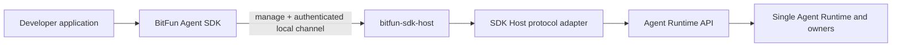

本图只放大 SDK 特有的跨进程路径；GUI/TUI、CLI、ACP 和 Server 的同级 adapter 关系以第 4 节产品视图为准，
不在这里再次折叠或定义。

依赖约束：

| 组件 | 必须 | 禁止 |
|---|---|---|
| `bitfun` CLI | 依赖共享 Runtime/Application 能力 | 依赖 SDK Host app、SDK protocol 或公开语言包 |
| GUI/TUI | 依赖共享应用用例和各自平台 adapter | 经公开 SDK 绕行 Runtime；共享 renderer/protocol |
| `bitfun-sdk-host` | 独立 composition root，选择 SDK profile | 依赖 CLI crate；成为第二个 Server 或 Runtime |
| SDK Host adapter | 协议、能力协商、连接/Query 资源租约（lease）和 DTO 映射 | stdin/stdout 入口、Agent 业务状态、Tool/MCP registry |
| Python/TypeScript SDK | 管理或连接匹配 Host，提供一致公开 API | 要求用户安装 `bitfun` CLI；暴露内部 wire DTO |

### 5.2 一次 Query 的运行时序

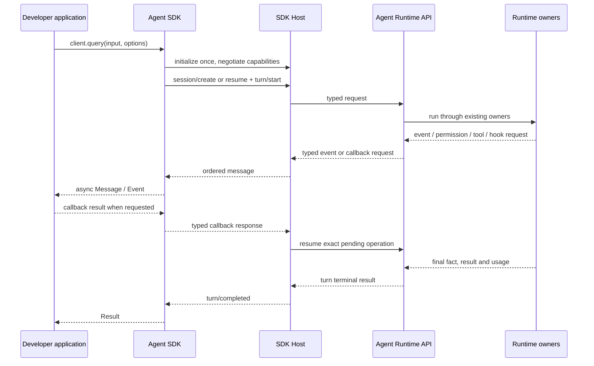

SDK 连接、Query、Session 和 callback invocation 使用不同的资源租约；租约只表示谁负责回收资源，不是另一套业务状态。
`Query.cancel()` 幂等地请求 Runtime 取消，Runtime 已结算的终态以 `Result` 为准。`Query.close()` 在 Query 活跃时执行取消、
有界等待结算并释放 stream/callback 注册；终态后只释放资源。各语言的 dispose/context-manager 语法映射到同一 `close()`。

`client.query()` 创建的临时 Session 由 Query 持有，Query 结算并关闭后随之释放；显式 `Session` 由调用方持有，
其 Query 关闭不会关闭 Session。`Session.close()` 停止新 Turn，取消并结算其活动 Query，再释放 Session-scoped lease；
它不关闭共享的 AgentClient/Host connection，也不等于删除或归档持久化 Session。只有 `AgentClient.close()` 才关闭连接并按
同一规则清理其活动 Session/Query。`client.query()` 与 `session.startTurn()` 是异步准入方法；Turn 被 Runtime 接受前的
启动失败直接返回 Operation Error，不产生 Query。接受后，Runtime 能确认的完成、失败和取消收敛为同一个 `Result`；
transport 丢失或清理超时而无法确认 Runtime 终态时，以 `outcome_certainty=unknown` 的 Operation Error 结束本地等待，
不得伪造 `Result`。迟到 callback 必须由 operation/generation identity 拒绝，不能重新激活已结算 Turn。

### 5.3 Host 流与 callback 不变量

| 主题 | 必须保持的不变量 |
|---|---|
| 身份 | connection、Session、Query、Turn、operation 和 callback invocation 使用不同的稳定身份；transport request id 不能代替 operation id |
| 顺序 | 每个 Query 的 Message/Event 使用严格递增 sequence；不承诺不同 Query 之间的全局顺序 |
| 终态屏障 | Runtime 已结算时，`Result` 恰好产生一次并成为最后一项；无法确认结算时以 Operation Error 结束本地流且不伪造 `Result`，两者之后都不得再发送事件或 callback |
| 背压 | 读写队列同时受条目数和字节数约束；overflow、写入 deadline 或输出失联触发 Query/connection 取消、结算和类型化错误，禁止静默丢事件 |
| 重连与重放 | 首个本地协议不透明重放旧 Query；断连后恢复 Session 并读取已知 Turn 事实，operation identity 只用于幂等、审计和恢复关联，不承诺通用 operation 查询 API |
| 连接清理 | 非显式 detach 的活动 Query 在断连时取消并有界等待结算后才释放租约；detach 不进入首个稳定 API |
| 清理超时 | 返回 `cleanup_incomplete`、`outcome_certainty=unknown`，保留 operation fence/tombstone，将 Session 和连接标记为不可复用；managed Host 由 supervisor 终止并回收，重新连接后先对账已知 Turn 事实 |

| Callback 不变量 | 规则 |
|---|---|
| 调用身份 | 每次请求携带 invocation、Query、Turn、operation、generation 和 deadline；只接受一次响应 |
| 迟到与重复 | 重复、过期或已取消响应返回稳定错误，不能再次提交 Runtime 状态 |
| Permission / Before Hook | handler 异常、超时、取消或连接丢失时 fail closed；不能扩大产品/组织/Host 策略上限 |
| After Hook | handler 失败时保留真实 Tool 结果和副作用事实，只增加诊断；绝不重放 Tool |
| 函数 Tool | handler 失败形成类型化 Tool failure；只有 owner 明确证明安全时才允许重试，不能重放整个 Turn |
| UserInput | 单次响应受 schema、大小和 deadline 约束；超时、异常或断连不提供默认答案，以类型化 `input_unavailable` 结束当前交互并按 Runtime 策略结算 Turn |
| Query 取消 | 取消向所有待处理 callback 传播；callback 清理完成或 deadline 到达后再发布 Query 终态 |

每一种 callback kind 单独参与 capability negotiation；不能因为 Permission callback 可用，就推断 UserInput、Tool 或 Hook
callback 也可用。

## 6. 公开 Agent SDK 形态

### 6.1 一个客户端，两种使用深度

公开 API 以一个 `AgentClient` 为权威入口：

```typescript
await using client = await AgentClient.start({ cwd });

// 常见的一次 Query；返回可迭代、可取消、可关闭的句柄。
await using query = await client.query({
  prompt: "Find and fix the failing test",
  allowedTools: ["Read", "Edit", "Bash"],
});
for await (const message of query) {
  // typed Message / Event / Result
}
const quickResult = await query.result(); // cached terminal Result from the stream

// 需要多轮、恢复或并发控制时使用显式 Session。
await using session = await client.sessions.create({ agent: "agentic" });
await using review = await session.startTurn({ prompt: "Review the resulting diff" });
for await (const event of review) {
  // observe, approve/deny, answer, cancel or steer when supported
}
const result = await review.result(); // same terminal Result emitted by the stream
```

Python 提供同一对象关系和生命周期。字段遵循各语言惯例，但能力、默认值、错误码、事件顺序和资源关闭语义必须一致。
自然消费到 `Result` 会释放 Runtime 的 active-query lease，`result()` 返回同一个缓存终态；调用方仍使用语言的
dispose/context-manager 语法关闭本地句柄，提前离开流则按 `close()` 的取消与结算语义处理。
示例冻结的是对象关系和职责，不提前冻结 package path、所有方法签名或字段；任何签名进入 preview 前都需通过双语言 fixture。

为降低第一次使用成本，可以在 preview 后评估顶层 `query()` 便捷函数；它只能是创建短生命周期 client 并调用
`client.query()` 的薄封装，不能拥有第二套配置、Session 或错误语义。正式签名前需由 Python/TypeScript 两个真实消费者验证。

### 6.2 核心能力门槛

| 能力类别 | 公开目标 | 单一 owner / 约束 |
|---|---|---|
| Query 与异步流 | typed Message/Event/Result、cancel/close/result、交互控制和唯一终态 | Agent Runtime / Event owner；唯一实时运行句柄 |
| Session 与 Turn | Session create/resume/fork/close；按 id 读取已知 Turn 的只读身份与已提交事实 | Session owner；close 不等于 delete/archive，也不构成通用 operation 查询 API |
| 执行上下文 | cwd/workspace、agent/model、预算/deadline、配置来源 | Product policy；凭据不进入普通 wire/log |
| 内置 Tool | 与 GUI/TUI/CLI 相同 catalog、权限和审计 | Tool owner |
| 自定义函数 Tool | Python/TS callback、schema、deadline、取消和大小限制 | 作为 Tool provider 注册；不创建 SDK Tool Runtime |
| MCP | 配置、ready/pending/failed 状态、catalog generation | 既有 MCP lifecycle owner；不创建 SDK 专用连接池 |
| Permission | allow/deny/ask callback 和类型化恢复 | Permission owner 保留最终上限；超时 fail closed |
| Hook | 稳定生命周期 callback、确定顺序、阻止/变换/观察 | 唯一 Hook Coordinator；不创建 SDK HookBus |
| UserInput | typed question/answer callback、schema/大小/deadline、取消和 unavailable 终态 | Agent Runtime interaction owner；不提供默认答案，不与 Permission 混用 |
| Subagent | 定义、委派、父子事件、权限和预算收紧 | Runtime/Subagent owner；父子取消可验证 |
| Skill/Plugin/来源 | 显式选择可信来源并报告实际状态 | External Source control；不输出生态原始对象 |
| Structured output | JSON Schema、验证失败与重试事实 | 与 CLI/Runtime 使用同一结果合同 |
| Usage/Trace | token、cost、cache、duration、correlation | Event/usage owner；低基数和默认脱敏 |

Goal、Deep Review、Harness、Remote execution 和 Mini App 可以作为 additive 能力出现，但不能替代上表的基础能力，
也不能迫使第一次使用 SDK 的用户先学习 BitFun 特有概念。

### 6.3 Capability 而不是猜测

SDK 在初始化后获得稳定 capability 集合。未交付能力必须明确为 unavailable/experimental，不得根据 Runtime 中存在同名
trait、空 port、内部事件或 CLI flag 推断可用。调用不支持能力返回类型化 `capability_unavailable`，不能静默切换为本机、
另一种权限模式或另一套 transport。

## 7. 外部应用与可定制界面

Agent SDK 不等于 UI SDK。外部开发者需要基础界面时，采用以下拓扑：

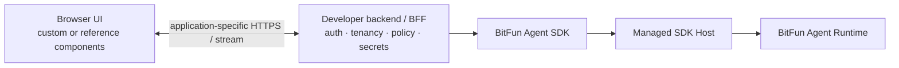

安全和职责边界：

- BFF 指面向该界面的开发者后端（Backend for Frontend），不是 BitFun 新增的公共服务。
- 浏览器不直接启动或连接本机 SDK Host，不持有 Provider/MCP/BitFun Host 凭据。
- 开发者后端负责用户认证、租户隔离、速率限制和把公开 SDK 事件投影为自己的前端协议。
- BitFun SDK 负责 Agent 能力；它不负责 React 状态、路由、主题、组件或业务认证。
- 第一方 `src/web-ui` 不作为 npm SDK 发布；它包含 Desktop/Server 产品假设和内部命令，直接复用会固化私有 ABI。

SDK Preview 提供最小参考应用，证明浏览器认证后端、流式 Query、取消和 `action_required` 的 fail-closed 展示；
Beta 再扩展 Permission callback、审批提交和断线/Host 崩溃恢复。参考应用是示例而不是稳定 UI ABI。
只有出现至少两个仓库外 UI 消费者后，才允许从重复需求中抽取独立、可选的 UI 工具层：

| 产物 | 交付时机 | 作用 | 约束 |
|---|---|---|---|
| Reference app（Preview） | SDK Preview | 展示后端接 SDK、前端流式事件、取消和待处理动作的只读提示 | 示例，不构成稳定 ABI；不伪造尚未交付的审批 callback |
| Reference app（Beta） | SDK Beta | 增加 Permission callback、审批提交和断线/Host 崩溃恢复 | 继续只消费公开 SDK，不访问 Host protocol |
| Headless UI controller | 两个真实消费者出现重复状态逻辑后 | Session/Turn/Message/Tool/Permission 的框架无关状态归约 | 只消费公开 SDK 事件；不访问 Host protocol |
| Copy-source components | 两个真实消费者出现重复组件需求后 | 对话、Tool、Permission、Plan、Usage 等可复制组件 | 独立包/registry；允许深度改造，不与 SDK 版本强绑定 |

这仍然是一个 Agent SDK 加一个可选 UI 工具层，不是“本地 SDK、远程 SDK、UI SDK”三套产品。

不同应用形态只改变 SDK 放置位置，不改变公开能力：

| 外部应用 | 推荐连接 | 说明 |
|---|---|---|
| 浏览器 Web 应用 | Browser → developer backend → SDK | 认证、密钥、策略和 callback 留在后端 |
| Electron/本地桌面或开发者工具 | trusted main/backend process → SDK | SDK 在受信本机管理 Host；renderer 只通过受限 IPC 访问 main process，不直接接 Host |
| 多租户服务 | server-side worker/backend process → SDK | 浏览器 service worker 不接 SDK；调用方另行负责租户隔离和 OS/容器沙箱，SDK Host 本身不是沙箱 |

## 8. Tool、MCP、Permission 与 Hook 的单一执行链

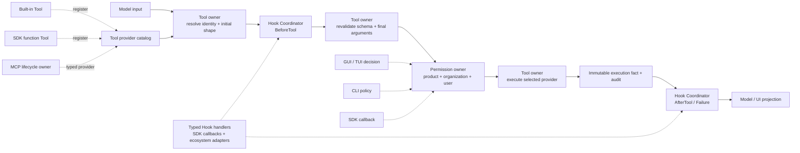

约束：

- GUI/TUI 决策、CLI flag 和 SDK callback 都只是输入；Permission owner 保留最终决定权。
- MCP 配置可来自产品设置、项目文件、CLI 或 SDK，但连接、认证、健康、重连和回收只有一个 lifecycle owner。
- SDK Hook 与 OpenCode/Claude/Codex adapter 共享 Hook Coordinator；adapter 只解释来源语义。
- Before Hook 修改参数后必须重新校验 schema 与权限；After Hook 不能覆盖真实副作用、成功/失败或审计事实。
- Safe Mode、Host capability 或 execution domain 不允许时，所有入口统一 fail closed；SDK 不回退本机。

## 9. Headless CLI 与 Agent SDK

CLI 和 SDK 共享能力事实，但不是上下层关系：

| 需求 | `bitfun exec` | Agent SDK |
|---|---|---|
| 一次性命令、shell 管道 | 首选 | 可用，但增加语言和 Host 生命周期 |
| 普通 CI | 首选：稳定退出码、JSON/JSONL、进程级 deadline | 只有需要 typed callback、并发 Session 或应用内状态时选择 |
| text/json/JSONL | 原生输出 | typed object / async iterator |
| 多轮 Session | ID/flag 恢复，适合脚本 | Session object 与长连接更自然 |
| 权限 | flag/配置/非交互 fail-closed | typed callback，加同一策略上限 |
| 自定义函数 Tool | 不把 shell callback 冻结为稳定 ABI | Python/TS function callback |
| Hook | 配置来源和可选事件投影 | typed callback |
| 并发 | 多进程，由调用方管理 | 一个受控 client/Host 上并发多个 Session |
| 资源关闭 | 进程终态和退出 | 显式 close/dispose、断连和 callback 清理 |

因此：

- CLI 不默认依赖 SDK Host，也不通过 SDK package 运行。
- SDK 不解析 CLI `stream-json` 作为正式双向协议。
- 普通脚本/CI 不需要为了“架构统一”改写成 SDK；复杂生产自动化才选择 SDK。
- 两者使用共同 behavior fixture 验证相同配置、权限和 Tool 结果，但 flags、事件投影和 transport 可以不同。

## 10. 合同、版本与发布视图

### 10.1 一份语义，多种投影

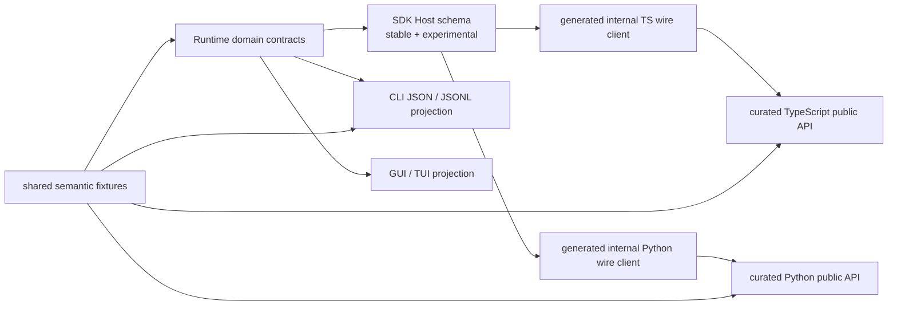

生成的 wire 类型保持 SDK 内部；公开 API 必须经过人工策划，不能把协议 DTO 原样暴露给用户。

### 10.2 防止持续迭代造成漂移

| 机制 | 作用 |
|---|---|
| 单一 Runtime owner | 能力新增只实现一次，入口只做投影和 callback bridge |
| 单一 Host schema | Python/TS 不各自手写 wire 类型和错误 |
| Schema drift CI | 代码生成结果有差异即失败，禁止忘记更新某个绑定 |
| Capability negotiation | 新旧 Host/SDK 明确知道哪些能力可用；不按版本号猜测 |
| Stable / experimental 分层 | 实验能力需显式 opt-in；稳定 API 不依赖实验字段 |
| Semantic conformance suite | 同一 Session/Turn/Tool/Permission/UserInput fixture 跨 Runtime、CLI、TS、Python 验证业务事实 |
| Compatibility matrix | 每个 SDK 版本声明 Host protocol 范围和 Runtime capability 下限 |
| Release gate | 语言包、Host binary、schema、文档和 fixture 同一发布流水线验证 |

版本分为三层：

1. **SDK API version**：Python/TypeScript 的公开方法和类型，遵循各自包的 semver。
2. **SDK Host protocol version range**：wire schema、方法、事件、错误与 capability。
3. **Runtime capability version**：Tool/MCP/Permission/Hook/UserInput 等业务语义版本。

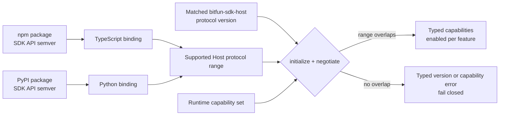

语言包版本、Host 协议版本和 Runtime 能力版本不能互相替代。握手先验证协议范围，再报告实际 capability；
版本兼容但能力缺失时仍必须返回明确不可用，不能根据 SDK 包版本推断 Runtime 已支持。

SDK 安装后必须能定位匹配 Host。TypeScript 可使用平台可选包，Python 可使用平台 wheel；具体打包方案可按仓库和签名体系调整，
但用户不应先安装或升级 `bitfun` CLI。连接预启动 Host 是高级模式，需双向认证、端点 owner/ACL 校验和 capability negotiation。

### 10.3 发布渠道

| 产物 | 推荐渠道 | 公开与兼容承诺 |
|---|---|---|
| TypeScript Agent SDK | npm | 公开 curated API；只有 GA stable namespace 承诺长期兼容，Preview/Beta 与 experimental 按阶段策略演进 |
| Python Agent SDK | PyPI | 公开 curated API；只有 GA stable namespace 承诺长期兼容，Preview/Beta 与 experimental 按阶段策略演进 |
| `bitfun-sdk-host` | 随 SDK 平台包/wheel 或受签名下载器提供 | 不是用户 API；协议是版本化兼容边界 |
| JSON/TypeScript schema | 构建产物和协议测试 fixture | wire 合同，不等于公开语言 API |
| Reference UI / components | 独立示例仓库或可选 registry | 示例或组件级版本，不绑定 SDK 主包 |

## 11. 错误、日志、指标与安全

公开 SDK 与 SDK Host 共享稳定错误信封，至少包含 `code`、`stage`、`retryable`、`message`、`operation_id`、
`causation_id`、不透明 `correlation_id`、`outcome_certainty`、最小可见身份和可选 recovery action。
调用方不得解析 message 驱动控制流。transport request id 只负责协议配对，不能代替跨重连保留、仅用于幂等、审计和
恢复关联的 operation identity。

`outcome_certainty` 是封闭事实：

| 值 | 含义 | 调用方动作 |
|---|---|---|
| `not_started` | 权威 owner 保证操作未被接受且没有副作用 | 只有 `retryable=true` 时才可用同一 operation identity 安全重试 |
| `committed` | owner 已记录权威终态；错误携带结果引用或 `resume_session` / `read_turn` recovery action | 读取已知 Turn/结果事实，不重新执行 |
| `unknown` | 连接/进程故障后无法证明是否已产生副作用 | 非幂等操作禁止自动重试；恢复 Session 读取已知 Turn，仍未知时人工对账 |

`retryable=true` 只表示协议和 owner 能证明使用同一 operation identity 重试安全；它不是“建议再试一次”。
写入、发送、删除、外部 Tool 或结果未知的 callback 默认不可重放。

| 类型 | 用途 | 约束 |
|---|---|---|
| Error | 当前操作失败和恢复 | 稳定 code；区分 validation/auth/permission/quota/version/timeout/cancel/process/internal |
| Diagnostic | Session/Tool/MCP/Hook/Host 的持续降级状态 | 生命周期明确；恢复后撤销 |
| Log | 本地开发和运维 | 英文结构化；默认不记录 prompt、参数、结果、环境变量和凭据 |
| Metric/Trace | 成功率、时延、队列、成本和因果链 | 低基数标签；身份、路径和内容不进 metric label |
| Audit | 权限、Hook 变换、Tool 副作用和管理动作 | 不可被 SDK callback 或插件覆盖 |

上述所有 Error、Diagnostic、Log、Trace 和 Audit surface 共用一套数据分类规则；应用主动请求的 Message/Result
属于业务 payload，不因此自动进入可观测数据：

| 数据类别 | 统一规则 | 允许的替代信息 |
|---|---|---|
| 凭据、token、header、环境变量秘密 | 永不进入错误、诊断、日志、trace、audit 或 metric | 仅记录稳定的缺失/拒绝错误码 |
| prompt、Tool 参数、模型/Tool 结果 | 默认不进入任何可观测 surface；显式调试也必须按策略授权、限时和脱敏 | schema 名、大小、内容摘要或受控 artifact 引用 |
| 本机路径、用户/Session/插件身份 | 最小化并按可见范围脱敏；不得成为 metric label | 不透明 ID、路径类别或受控 hash |
| correlation/operation/causation identity | 必须不透明、不可由内容推导，不包含路径或用户输入 | 稳定随机标识 |
| Audit 事实 | 记录决策、owner、稳定 ID、摘要和时间，不保存原始敏感 payload | 内容指纹和受访问控制的 artifact ref |

日志、trace 和 audit 必须有明确访问边界、保留期与删除策略；含 secret/path/prompt 的跨语言 fixture 是发布门禁，
不能只验证 Rust Host 的序列化结果。

安全边界：

- SDK Host/CLI/Node/Python 进程治理用于取消和回收，不等于操作系统安全沙箱。
- 本地 Host 默认只接受父 SDK 的受控通道；预启动 Host 在业务 payload 前完成双向认证。
- callback 只能返回候选结果，不能直接修改 Runtime 权威状态或扩大组织/产品策略。
- 远程 SDK 后续必须复用 Server/Remote 的认证、execution domain、凭据 owner 和断线策略；不能把本地 Host 协议直接暴露到网络。

## 12. 所有权视图：SDK、扩展与外部界面的边界

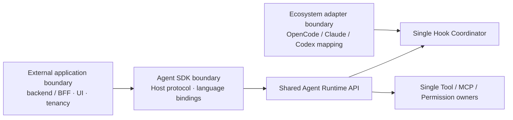

| 边界 | 负责 | 不负责 |
|---|---|---|
| Agent SDK | 公开对象、语言绑定、Host 生命周期、协议投影和 callback transport | 生态配置解析、第一方 UI、Runtime 业务状态 |
| 生态 adapter | 来源发现、宿主语义映射、兼容诊断和 fixture | 公开 SDK transport、通用 Hook 调度、Runtime owner |
| 外部应用/BFF | 认证、租户、应用策略、界面状态和自定义交互 | 直连本机 Host、复制 Agent loop、保存 BitFun 凭据 |
| Agent Runtime API | 跨入口共享的 Query/Session/Turn 应用用例 | 语言包、renderer、生态私有 payload |
| Tool/MCP/Permission/Hook owner | 最终业务事实、顺序、权限、审计和生命周期 | 为某一 SDK 或生态复制专用实现 |
| UserInput interaction owner | 问题身份、可见范围、回答提交、取消和终态 | 把输入 callback 当作 Permission 或提供默认答案 |

外部 Hook adapter 负责来源与语义映射，SDK 负责语言 callback transport；二者最终汇入同一个 Hook Coordinator。
任何跨边界能力都必须先确定唯一 owner、稳定事实和失败语义，不得通过复制类型、私有 registry、平行 HookBus，
或按 ecosystem ID 在 Core 分支来规避边界。

## 13. 成熟度与发布门槛

| 阶段 | 可以宣称 | 不可宣称 |
|---|---|---|
| Internal | Host/protocol 候选可供仓库内验证 | 可安装 Agent SDK、跨语言兼容 |
| Preview | Python/TS 可安装，核心 Query/Session/取消/错误有真实样例 | Claude 核心能力等价、生产稳定 |
| Beta | Tool/MCP/Permission/Hook/UserInput callback 和升级/崩溃恢复闭环 | 长期兼容或全部 additive 能力 |
| GA | 冻结能力矩阵、协议/语言一致性、全平台生命周期和外部消费者通过 | 对未来竞品滚动版本自动等价 |

GA 必须同时满足：

- 冻结版本的 Claude Agent SDK 稳定核心能力无静默缺口；每项标记 native/translated/additive。
- TypeScript 和 Python 至少各有一个仓库外真实消费者，并通过同一 conformance suite。
- SDK/Host 安装、升级、版本不匹配、崩溃、取消和完整进程树回收通过 Windows/macOS/Linux 验证。
- Session resume/fork、structured output、usage、Tool/MCP/Permission/Hook/UserInput callback 有端到端样例。
- CLI 与 SDK 共同 fixture 证明业务事实一致，但 CLI 仍不依赖 SDK Host。
- schema drift、stable/experimental、capability negotiation、错误码和兼容矩阵进入发布门禁。
- API 参考、快速开始、迁移说明、安全模型和外部 UI 参考架构完整。

## 14. 明确非目标

- 不提供 Claude Agent SDK 的 import-compatible 或 source-compatible 替换包。
- 不发布多个互不兼容的“本地 SDK”“远程 SDK”“UI SDK”。
- 不让 CLI、GUI/TUI、ACP 或 Server 依赖公开 Python/TypeScript SDK 或 SDK Host。
- 不把 `stream-json`、ACP 或 HTTP Server 全量路由冒充正式 Agent SDK。
- 不发布 BitFun 第一方 React UI 作为稳定 SDK ABI。
- 不把 OpenCode/Claude/Codex 原始插件对象、Hook payload 或配置类型带入 Runtime 公共合同。
- 不在没有真实消费者、owner 和失败语义时建立通用工作流、HookBus、远程 SDK transport 或公共 Capability SDK。

## 15. 参考基线

- [Claude Agent SDK overview](https://code.claude.com/docs/en/agent-sdk/overview)
- [Claude Agent SDK agent loop](https://code.claude.com/docs/en/agent-sdk/agent-loop)
- [Claude Agent SDK hooks](https://code.claude.com/docs/en/agent-sdk/hooks)
- [Claude Agent SDK sessions](https://code.claude.com/docs/en/agent-sdk/sessions)
- [OpenCode SDK](https://opencode.ai/docs/sdk/)
- [OpenCode Server](https://opencode.ai/docs/server/)
- [Codex TypeScript SDK](https://github.com/openai/codex/blob/main/sdk/typescript/README.md)
- [Codex App Server](https://github.com/openai/codex/blob/main/codex-rs/app-server/README.md)
- [GitHub Copilot SDK](https://github.com/github/copilot-sdk)
- [Copilot SDK/CLI compatibility](https://docs.github.com/en/copilot/how-tos/copilot-sdk/troubleshooting/compatibility)
- [Vercel AI SDK UI transport](https://ai-sdk.dev/docs/ai-sdk-ui/transport)
- [AI Elements](https://elements.ai-sdk.dev/)
