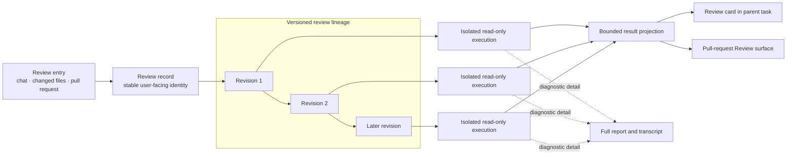
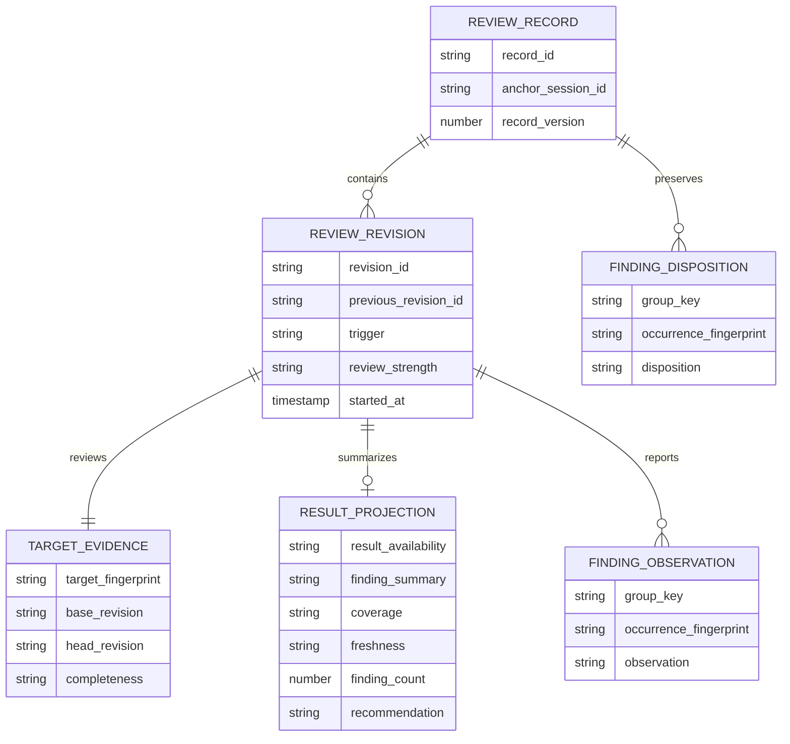
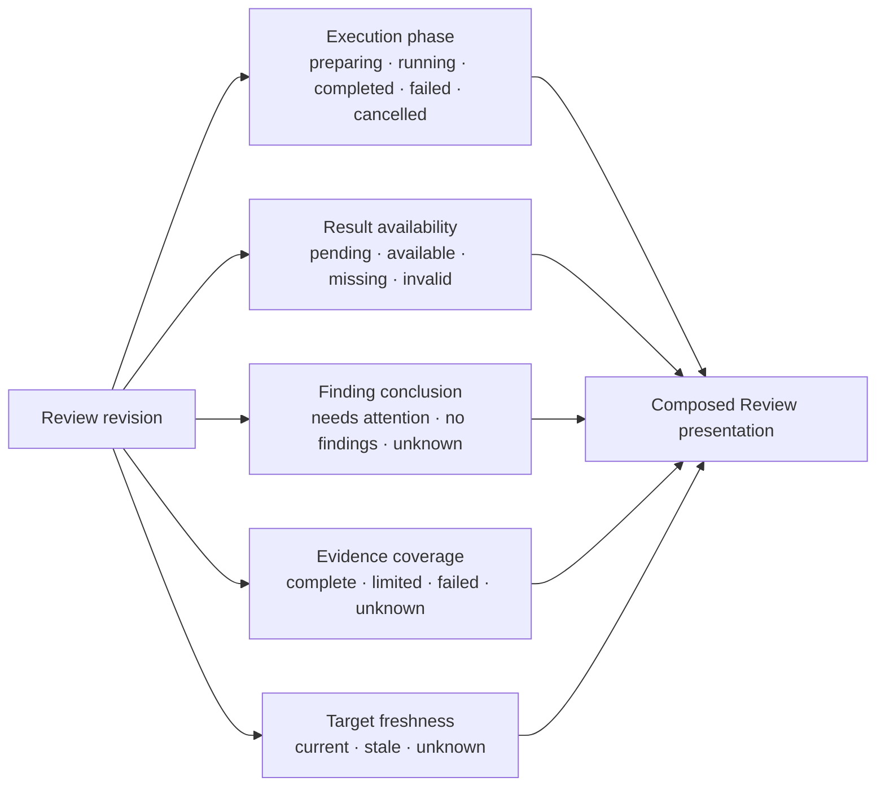
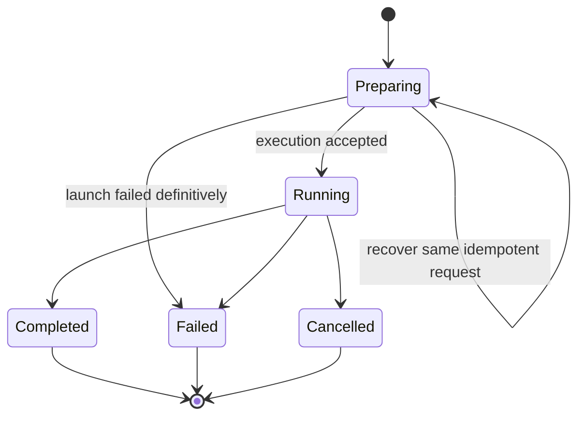
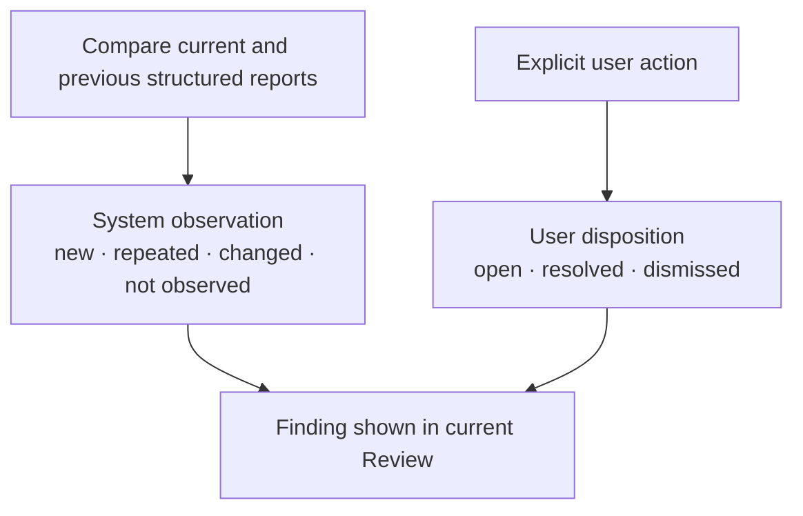
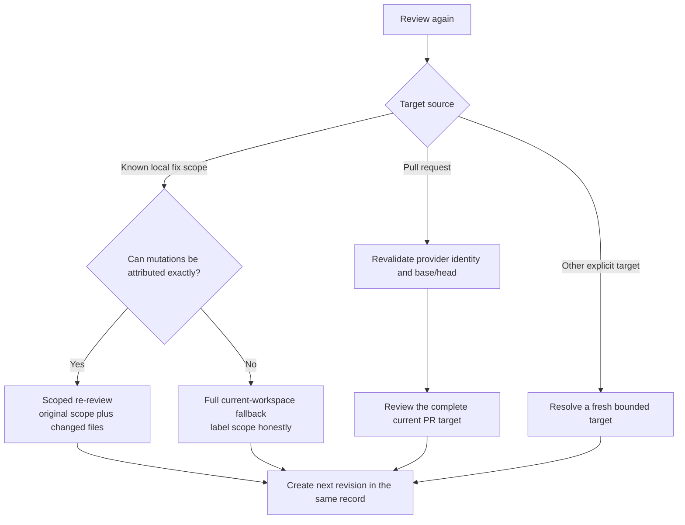
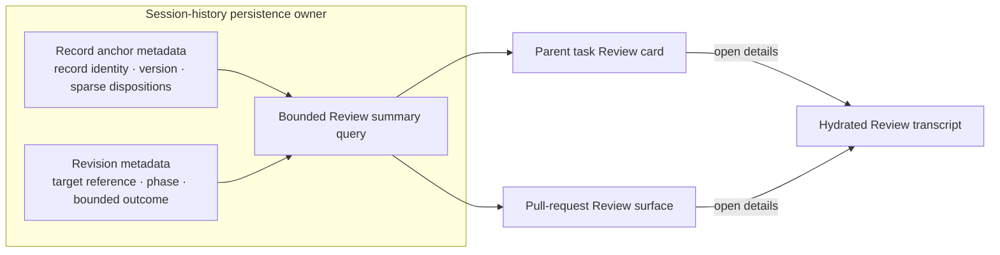

# Review Lifecycle Architecture

## Purpose and status

This document defines the target product architecture for Review identity,
revision history, freshness, result presentation, and re-review. It is an
adopted design direction, not a claim that every contract described here is
already implemented.

The current execution baseline remains in
[deep-review.md](deep-review.md): Review resolves bounded target evidence and
runs an isolated read-only `CodeReview` or `DeepReview` child. Today, one run is
still represented primarily by that child session. This design adds a stable
user-facing layer above those executions; it does not replace their runtime,
target-evidence, or safety owners.

The product outcome is simple:

- one explicit review lineage is one **Review record**;
- each initial run or user-requested re-review is one **revision** of that
  record;
- child sessions, workers, and quality checks remain execution details;
- Review starts in the background and leaves a durable result surface in the
  parent task;
- the latest revision is primary, while older revisions remain inspectable;
- no AI conclusion is presented as a gate result or as proof that a change is
  safe to merge.

## Architecture overview

The Review record is the durable product identity. An execution child is a
replaceable implementation mechanism for one revision. The bounded projection
allows list and card restoration without loading a full transcript; the full
structured report remains the source of detailed findings.

This separation follows three ownership rules:

1. **Product identity stays stable.** A new child does not create a second
   user-facing Review when the user is explicitly reviewing the same lineage
   again.
2. **Execution remains isolated.** Read-only reviewer sessions preserve
   independent context and cannot edit the target while reviewing it.
3. **Evidence remains authoritative.** The record describes a run; it never
   widens, replaces, or guesses the prepared target evidence owned by the
   existing Review launch path.

## Domain model

### Review record

A record represents one explicit review lineage. The first Review child is its
persisted anchor and creates the stable record identity. Later revisions point
back to that anchor. The identity is reused only when the user selects a
re-review action for the record, including a post-fix review. Two independent
launches must not be merged merely because their file lists or pull-request
revisions look similar.

The record carries only facts shared by the lineage, including sparse
user-owned finding dispositions. Target identity, Review strength, and model
conclusions belong to individual revisions, so an explicit stronger re-review
does not require a second record.

### Review revision

Each revision has an immutable identity, trigger, Review strength, start time,
and optional predecessor. It points to the existing prepared target evidence
rather than copying the diff or repository contents. A revision may persist a
bounded outcome projection containing only what list and card views require,
such as:

- result availability and completion time;
- coverage (`complete`, `limited`, `failed`, or `unknown`) and target freshness
  (`current`, `stale`, or `unknown`) as separate facts;
- finding count and risk level;
- model recommendation and a short assessment;
- cross-revision observation counts when available.

Issue bodies, full diffs, model messages, and tool transcripts do not belong in
the projection. Keeping the projection bounded prevents session metadata from
becoming a second report store.

### Lifecycle and outcome projection

Execution phase, result availability, finding conclusion, evidence coverage,
and target freshness are independent facts. They must not be collapsed into one
state enum: a stale Review may still contain important findings, and a Review
with limited coverage may still need immediate attention.

Only execution phase is a lifecycle state machine:

The preparing self-loop may repair session creation or delivery acknowledgement
for the same idempotent request; it must not submit a second logical reviewer
turn. Once a revision has started or reached a terminal phase, explicit Retry,
Review again, post-fix Review, or Review current version creates a new immutable
revision. Target staleness never rewrites the prior revision's execution phase.

The UI composes the dimensions instead of choosing one winner. Examples include
“Needs attention · limited coverage”, “No actionable findings · current target”,
and “Needs attention · stale target”. `stale` is reserved for target-version
mismatch; `limited` describes coverage of the target that was actually reviewed.

A lossless source contract is required before this projection ships. The
current single `evidence_status` value cannot be the only source because a stale
target may also have limited coverage. Structured Review output must preserve
independent `coverage` and `freshness` fields, or equivalent machine-readable
reason codes from which both can be derived without precedence-based
overwriting. The derivation rules are:

- workspace freshness compares the prepared workspace fingerprint with the
  current fingerprint; mismatch is stale and unavailable comparison is unknown;
- an explicit Git range resolved to immutable object ids is current for that
  selected range unless its objects or binding can no longer be validated;
- pull-request freshness requires a refreshed exact provider identity and
  base/head comparison; mismatch is stale and failed refresh is unknown;
- coverage is computed from prepared diff completeness, omissions, unavailable
  content, and execution coverage, and is never rewritten merely because
  freshness changed.

“No findings” must include coverage and freshness and must not be rendered as
“passed”, “approved”, or “safe to merge”. A model recommendation remains advice,
not a repository gate result.

## Finding continuity

Finding continuity has two independent dimensions:

- **Observation** describes what the current reviewer reported relative to the
  prior revision.
- **Disposition** records an explicit user decision and is never inferred from
  model silence.
- A finding that is absent from a sufficiently covered later report becomes
  `not observed`, not automatically `resolved`.
- A stable **group key** based on normalized path, category, and title keeps
  related findings together across revisions.
- A separate **occurrence fingerprint** covers the normalized evidence that may
  change the finding's meaning, including location, severity, certainty,
  description, and validation evidence when present.
- Disposition carries forward only when both the group key and occurrence
  fingerprint match exactly. The same group with changed evidence is surfaced
  as `changed` and returns to open attention.
- Similar text is not enough to claim semantic identity. Fuzzy or model-based
  matching may support future suggestions, but it must not close findings.

Both keys use versioned deterministic normalization. The group key is a
continuity aid, while the occurrence fingerprint protects user decisions from
being applied to materially different evidence. Neither key proves that two
natural-language descriptions are semantically identical.

## Execution and re-review boundaries

Review strength remains controlled by explicit intent. Ordinary Review keeps
ordinary strength: bounded targets use one `CodeReview` child, while a large or
provider-limited target may use bounded managed packets without becoming a
different user-facing mode. Strict Review may select a concrete independent
lens from the actual change or a focus named by the user. Fixed architecture,
frontend, performance, product, or security agents are not exposed as required
user choices.

Starting Review creates the durable revision before sending the first reviewer
turn. It leaves the user in the parent task by default. Opening execution detail
is explicit, and an empty or metadata-only child must show preparing, loading,
or load-failed state instead of a blank pane.

Every re-review refreshes target evidence before execution:

Pull-request providers currently guarantee the current pull-request base/head
target, not an arbitrary previous-head-to-current-head delta across all
supported platforms. A PR re-review therefore reviews the complete refreshed
target and compares structured results by revision. It must not be marketed as
a token-saving delta review unless a future provider-neutral delta contract can
prove that scope.

Existing diff-page suppression and file-read receipts remain the evidence-read
optimization owners. The Review record must not add another content cache or a
second interpretation of which bytes were reviewed.

## Product projection

The same record is projected into two existing product surfaces:

| Surface | Primary content | Secondary detail |
|---|---|---|
| Parent task | target, latest revision, freshness, coverage, findings, next action | open the structured Review result |
| Pull-request panel | latest matching record for verified provider identity and base/head | older revisions and stale-result history |

Starting a Review does not force-open an internal child pane. The Review card is
available immediately and remains useful after restart. Opening the card shows
the structured result and remediation actions; raw execution messages are a
diagnostic view, not the product's main result.

The pull-request surface continues to use exact provider identity and verified
base/head freshness. A stale record offers “Review current version” and creates
another revision of that record. Cached pull-request overview data is not
sufficient to mark a Review current.

## Persistence, recovery, and compatibility

The existing session-history persistence service is the only storage and query
owner for Review records. It stores a small record anchor on the first Review
child and revision metadata on every Review child; no parallel Review database
or UI-owned index is introduced.

- The record anchor owns stable lineage identity and sparse explicit finding
  dispositions. Record mutations go through one record-metadata service,
  serialize writes per record, and reject stale updates with a monotonic record
  version.
- Revision metadata owns immutable revision identity, target reference,
  execution phase, and the bounded outcome projection. It does not own
  record-level user decisions.
- Parent-task lookup queries persisted Review summaries by parent relationship.
  Pull-request lookup queries by exact provider/repository/pull-request identity
  and verified base/head. Neither surface may infer the latest record by scanning
  only the sessions currently loaded in UI memory.
- The query is a bounded projection over existing session metadata, not another
  persistence store. Full reports and issue bodies are hydrated only when the
  user opens details.
- Archive, retention, and deletion operate on the record as one ownership
  group. The product does not expose permanent deletion of an anchor or
  individual revision while sibling revisions remain. Deleting a Review removes
  its anchor and revisions through the session-history owner; remote sync and
  cleanup use the same record-level operation.
- If external corruption or legacy cleanup leaves revisions without their
  anchor, the query returns a read-only `history incomplete` record. It does not
  reconstruct missing dispositions or silently choose a new anchor; Review
  again starts a new record, while whole-record deletion remains available.
- The full structured report remains recoverable from the Review transcript;
  projection write failure must not destroy the report.
- A metadata-only restore can render target, lifecycle, and bounded outcome
  before transcript hydration. Opening details then hydrates the child.
- Idempotent launch retry reuses the same immutable revision identity. An
  uncertain launch acknowledgement must not silently submit a second reviewer
  turn.
- Existing Review sessions without record metadata are projected as one legacy
  record using their child identity. No bulk migration or parallel persistence
  store is required.
- User finding dispositions are sparse and keyed by exact group key plus
  occurrence fingerprint. Default-open observations and full issue bodies are
  not duplicated into metadata.

## Quality and governance

This architecture does not require a Review-specific telemetry pipeline. The
Quality Data Plane remains the future shared owner for registered product
events; creating separate Review logs, analytics storage, or a dashboard would
split governance without improving correctness.

The design must instead be protected first by deterministic acceptance
evidence:

- launch does not force-open execution detail;
- no Review state renders as an unexplained blank pane;
- metadata-only restore shows a useful bounded summary;
- stale pull-request revisions cannot be presented as current;
- re-review preserves one record and creates a distinct revision;
- model silence never resolves a finding;
- record projection adds no model call and no duplicate content read;
- Review remains read-only, and remediation still requires the separate
  user-approved fixer path.

If the shared Quality Data Plane gains a production producer, Review may emit
only registered lifecycle and explicit feedback facts with defined retention,
privacy, ownership, and denominator rules. Instrumentation is not an excuse to
introduce another Review runtime or persistence owner.

## Non-goals

- Automatic Review on every save, push, or pull-request update.
- Automatic comment publishing, approval, merge, or gate enforcement.
- A generic workflow or agent-orchestration framework.
- A user-visible roster of fixed specialist agents.
- Fuzzy semantic finding closure or model-driven disposition changes.
- Reusing a local result for a pull request without exact repository, target,
  content, policy, and context equivalence.
- Pretending that every provider supports arbitrary revision-delta Review.
- A new telemetry store, analytics dashboard, or Review-only data plane.

## Related architecture

- [deep-review.md](deep-review.md) owns current standard, managed, and strict
  execution policy, target evidence, read-only roles, queueing, and report
  submission.
- [product-architecture.md](product-architecture.md) defines the repository
  layers and platform-adapter boundary.
- [../sdlc-harness/product-requirements-agent-workflow-adjustment.md](../sdlc-harness/product-requirements-agent-workflow-adjustment.md)
  explains the user-facing Review and workflow requirements without defining a
  second runtime.
